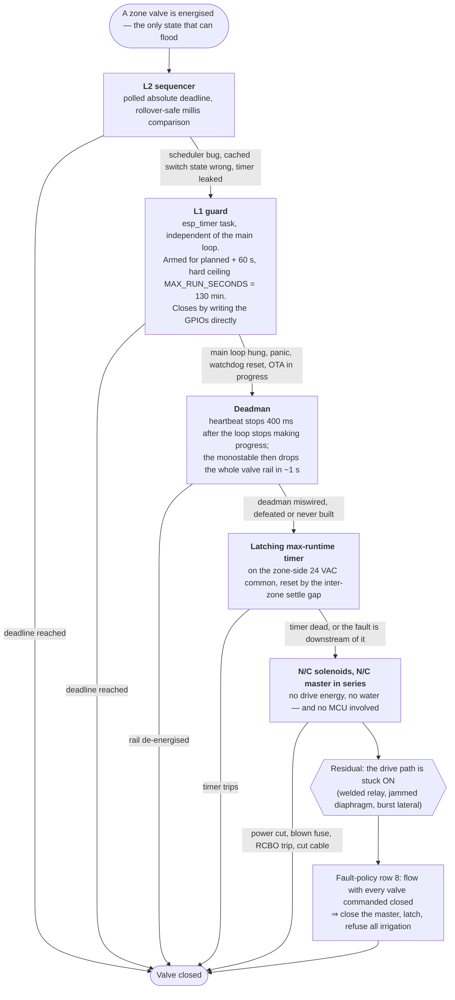

[← Documentation index](../README.md)

# 5. Fault-behaviour policy

**This table is the authoritative statement of intended behaviour and needs your sign-off.** It exists
because your requirement 3 as written ("fall back to closed on any issue — including network
connection issue") conflicts directly with requirement 1 (autonomy). Taken literally, a Wi-Fi hiccup
at 21:05 stops the run — and Wi-Fi hiccups are the single most common event in the system's life.

The resolution is to separate two different things:

- **Fail closed** — a hardware property: on loss of drive energy, no uncontrolled water flows. Always true.
- **Stop irrigating** — a policy choice, per fault class. For most fault classes the correct answer is
  **keep watering**.

> ✅ **Confirmed by the owner on 2026-09-05.** Rows 1–3 stand as written: a network fault neither stops
> a run nor reboots the device. The invariant that matters is P0 — never stuck open — and that is
> enforced by hardware, independently of any network state.

| # | Fault | During a run | Future scheduled runs | Alarm |
|---|---|---|---|---|
| 1 | Wi-Fi down | **Continue to completion** | **Continue normally** | INFO (raised by HA when it returns) |
| 2 | HA unreachable, Wi-Fi up | Continue | Continue | INFO |
| 3 | HA unreachable >24 h | Continue | Continue, **decay HA modifiers to permissive defaults** | WARNING |
| 4 | ESP reboot mid-run | Valves de-energise (hardware). **Do not auto-resume** | Resume normal schedule | WARNING; run logged `interrupted` |
| 5 | Power cut | As #4 (note: no water flowed either, the supply was off) | Normal | WARNING |
| 6 | **Clock not trusted** (no RTC, no sync since boot) | Stop | **Refuse scheduled runs.** Manual runs still allowed — a duration is a stopwatch, not a clock | **CRITICAL** |
| 7 | **Zero flow while a zone is open** | Abort zone, advance to next | Skip that zone for the day | **CRITICAL, latching** |
| 8 | **Flow while all valves commanded closed** | — | **Close master. Refuse all irrigation.** | **CRITICAL, latching** |
| 9 | **Flow ≫ zone baseline** (burst) | **Abort within seconds**, close master | Lock out that zone | **CRITICAL, latching** |
| 10 | Over-run guard tripped | Force closed | Lock out that zone | **CRITICAL, latching** |
| 11 | Valve coil open/short (current sense) | Force closed | Lock out that zone | CRITICAL |
| 12 | Freeze (air temp < threshold) | Abort | Suspend all irrigation until above threshold + hysteresis | WARNING |
| 13 | Config replica stale/mismatched | Continue | Continue on the replica — it is the only truth available | WARNING |
| 14 | Watchdog reset loop | — | **Safe mode: all closed, no irrigation, advertise the fault only** | CRITICAL, latching |
| 15 | Corrupted config (CRC fail) | Continue current run | Fall back to last-known-good bank; if none, refuse scheduled runs | **CRITICAL, latching** |

**The one genuinely dangerous case is #8** — water flowing with no supervision (stuck diaphragm, welded
relay, burst lateral). It is the only failure that causes unbounded damage. Everything else is a dead
plant. Detecting it requires a flow meter; stopping it requires a master valve. Both are therefore v1.

## Fail closed, layer by layer

The table above says *what* should happen; this says *what makes it happen*. Each layer exists only
to catch the failure of the one above it, and the two lowest ones need no working firmware at all
(**P1**). Read it as an escalation: a run reaches the next layer down only when everything above has
already failed.

**Only the top two layers are software, and neither is trusted.** The guard is a *backstop*: if it
ever fires during a normal run, the sequencer has failed, and that is worth an alarm in itself. Below
the guard nothing in the chain can be affected by a firmware bug, an OTA, or a boot loop — which is
the whole content of P1.

**The residual branch is the reason row 8 exists.** No amount of de-energising helps once the water
path is mechanically stuck open, so the last layer is not prevention but detection: a volumetric
meter reading flow while everything is commanded closed, and a master valve in series to act on it.
That is why both are v1 safety components and not v2 metering niceties (**P5**).

---
