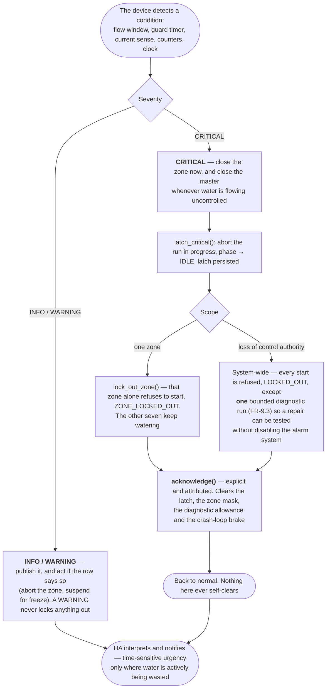

[← Documentation index](../README.md)

# 11. Alarms

**Split: the device detects, latches and acts (closing a valve cannot wait for a round trip and must
work with HA down); HA interprets and notifies (it owns the only channel, and `allow_service_calls:
false` means the firmware cannot call HA services anyway).** This mirrors what you already built for
the pool.

## Device-side (detect + fail closed + latch)

| Condition | Detection | Action |
|---|---|---|
| **No flow** | valve open, flow < 10 % of nominal for 60 s | Close, `no_flow`, latch, skip zone for the day |
| **Low flow** | 10–60 % of nominal for 120 s | Complete the run (it *is* watering, badly), flag, latch |
| **Excessive flow** | > 200 % of nominal | **Close immediately** + close master, latch |
| **Flow, all valves closed** | flow > 0 for 60 s | Close master, latch controller fault |
| **Overrun** | independent guard timer | Force close, latch |
| **Zone never ran** | window elapsed with no run | Outcome `never_ran` |
| **Clock invalid** | no trusted sync | `clock_valid: off`, suspend scheduled runs |
| **Freeze** | local temp < threshold | Suspend, drain if plumbing supports it |
| **Daily litre cap exceeded** | counters | Stop everything, latch — backstop against a logic bug watering all day |

## HA-side (things the device structurally cannot know)

Controller unreachable (`for: 15 min`, explicit `from:`/`to:`); hold stuck on >24 h (timer in firmware,
HA triggers on the flag); config edited but never applied; **rain feed gone stale** (i.e. HA's own push
automation is broken); nothing watered in N days in season; month-on-month or year-on-year volume
anomaly (only HA has the long-term statistics).

## From detection to acknowledgement

The two tables say what is detected and by whom. This says what an alarm then *does* — and in
particular why a `CRITICAL` cannot clear itself.

**The asymmetry is deliberate.** A `WARNING` costs a dead plant; a `CRITICAL` is the class of fault
that wastes water without supervision, so it latches and requires a human to say "I have looked". The
one concession is the single diagnostic run — *a system that must be disabled to be repaired will be
disabled permanently.*

## Alarm fatigue is the real risk

Only genuine **loss of control authority** is `CRITICAL`. `WARNING` never locks out. Reserve
`interruption-level: time-sensitive` for cases where **water is actively being wasted** (excess flow,
flow-with-valves-closed) — everything else gets default urgency. And always provide a **bounded single
diagnostic run** so a repair can be tested without disabling the alarm system, because a system that
must be disabled to be repaired *will* be disabled permanently.

---
