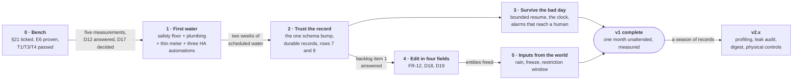

[← Documentation index](../README.md)

# 15. Roadmap

**Guiding principle: test the riskiest assumptions with the cheapest artefacts, and let no water touch
the garden until the safety layer is proven on a bench.** The temptation is to plumb first because
plumbing is the visible, satisfying part. Resist it — plumbing is the *irreversible* part, and the
measurements you need in order to plumb correctly come from a bucket and a stopwatch, not from code.

## v0 — Bench prototype (no water, no garden)

ESP32 + relay board + **LEDs instead of valves**. Stock `sprinkler` for sequencing. RTC fitted and
proven from day one — set the clock, pull all power for 24 h, confirm time and DST. The scheduler as a
pure unit-tested function with a DST/leap-day/month-boundary test table. Independent over-run timer in
a separate code path, proven by killing the scheduler. Fail-closed *proven, not assumed*: reboot 20×
mid-run, hold the board in reset, deliberately hang a task. On-device manual-run enforcement. HA
integration with Noise encryption and the availability watchdog, proven by unplugging the board.
Hold/Pause/Stop as three verbs. **Dry-run mode with time acceleration.**

**Exit criteria:** every row of [§5](03-fault-policy.md) has a demonstrated, recorded behaviour;
unit tests green including DST; a simulated season runs unattended.

> ### Status — 2026-09-05: **built, not yet proven on hardware**
>
> | Exit criterion | State |
> |---|---|
> | Unit tests green including DST | ✅ **61 tests**, ~0.2 s, no toolchain needed. The DST table walks both 2026 transition days minute by minute and asserts each program fires **exactly once** — the case an edge-triggered cron gets wrong twice a year. Plus leap day, the 31st/1st boundary, and new year. |
> | A simulated season runs unattended | ✅ 1 March → 31 October at one-minute ticks, 131 injected reboots, a holiday hold, a latched CRITICAL and a winter switch, asserting invariants continuously. **It found a real bug** — see the changelog. |
> | Every row of [§5](03-fault-policy.md) demonstrated | ⏳ The firmware side is written and compiles; the demonstrations are a checklist in **[§21](21-bench-procedure.md)**. Rows 7–9 and 11 are **deferred to v1** — they need a flow meter and coil current sensing, neither of which exists on a bench. |
>
> **Eight zones wired, four planted** (2026-09-06). The relay board is 8-channel and all eight
> channels are on GPIOs, so the firmware declares eight: a pin that can reach a relay coil is a pin
> the guard must be able to close, planted or not. How many actually water is a *schedule* question —
> a zone with 0 minutes in every program is left out of the resolved plan entirely — so adding the
> fifth bed is a duration edit, not a firmware change.
>
> **Two hardware items still gate connecting anything to water:** the relay board's T1/T3/T4 bench
> tests (E1–E3), and **E6** — proving the deadman de-energises the rail under a *deliberately hung*
> firmware. The firmware carries the instrumentation for E6 (a button that hangs the main loop on
> purpose); the circuit it is meant to exercise has not been built.

## From the bench to the garden — the iterations

Everything above says *what* gets built. This section says *in what order*, and it exists because the
honest reading of "v1 — Minimum viable garden" below is a big-bang: the ten requirements, all at once,
on the first day water flows. That is how a two-month project becomes a two-year one. So v1 is cut
into **five iterations**. Each ends with water on the garden, a tagged firmware and evidence in the
repository, and each is small enough that when it goes wrong it is obvious *which* thing went wrong.

The first one has a deliberately plain name. **The MVP is the smallest system that waters the four
planted beds on schedule, autonomously, and cannot leave a valve open.** Everything the specification
asks for beyond that — records, resume, rain, the interface — is added on top, one iteration at a
time, in an order that puts *seeing* before *deciding* and *surviving* before *convenience*.

### Why it is sliced this way

Five rules. Every cut below follows from one of them.

1. **The safety floor is not iterated. It is complete before the first litre and never changes shape
   afterwards.** Everything below the guard in the [escalation ladder](03-fault-policy.md#fail-closed-layer-by-layer)
   — the deadman, the latching backstop, N/C valves with the N/C master in series, the kill switch,
   the bypass — goes in whole during Iteration 1. Later iterations add things *above* the guard:
   resolver inputs, records, entities, notifications. Nothing an iteration adds may weaken a layer
   below the guard, and nothing is added *to* those layers without a fresh bench demonstration
   ([§21](21-bench-procedure.md)). This is P1 restated as a delivery rule.
2. **Plumbing is irreversible, so it is done once, at full width.** [§7b](06-buy-vs-build.md#reversibility--this-is-the-part-that-actually-matters)
   already separates the ~€905 irreversible spend from the ~€350 reversible one. The manifold carries
   eight valve positions plus the master plus a spare from day one; the meter is plumbed in
   Iteration 1 even though its firmware is thin; the filter and the bypass go in before anything
   downstream of them. Iterating is for firmware, Home Assistant and documentation — the three things
   that cost an afternoon to change.
3. **Observe before you decide.** No iteration adds intelligence — rain, profiling, forecast — before
   the one that makes the system's behaviour auditable. NFR-R4 says it outright: *the audit trail is
   the reliability instrument.* A rain threshold cannot be tuned against runs nobody can see.
4. **One schema bump, early, while the schedule is four zones and two programs.** FR-5.8 refuses an old
   record rather than reinterpreting it, so every `SCHEMA_VERSION` bump costs re-entering the schedule
   by hand. That is ten minutes with four zones in autumn and an evening with eight zones and four
   programs in July. Every change the later iterations need in the persisted schedule — per-zone
   predicates and labels (FR-5.11, FR-12.6.11), a nominal flow per zone, reserved bytes — lands in
   **one** bump, in Iteration 2. A bump anywhere else is a red flag that needs a decision entry.
5. **The entity budget is spent per iteration and written down.** The ledger in
   [§9](08-home-assistant.md#the-budget-and-the-fact-that-it-closes) closes at 128 of ~130 — and it
   does not yet count the sensors the fault policy itself needs (latch tripped, kill-switch position,
   indoor leak, outdoor temperature), nor does it subtract the 24 per-zone config mirrors that D18
   makes redundant. Running the count iteration by iteration (below) shows **the ceiling is reached in
   Iteration 3 and only relieved by D18**. That is what fixes the order of Iterations 4 and 5: the
   editor, which frees entities, comes before the inputs, which spend them.

### At a glance

| # | Iteration | Tag | The question it answers | §5 rows demonstrated on the installed system |
|---|---|---|---|---|
| 0 | Bench | `v0.1` | Does every row a bench *can* show, show? | 1–6, 10, 14, 15 — on LEDs |
| **1** | **First water — the MVP** | **`v1.0`** | Does it water the four beds on schedule with no network, and can nothing leave a valve open? | 1–6, **8**, 10, 14, 15 — with water |
| 2 | Trust the record | `v1.1` | Did it water what it planned, and can I tell a skip from a gap — even when HA was down? | 7, 9 |
| 3 | Survive the bad day | `v1.2` | What happens at 05:00 when something is wrong, and who finds out? | 4 and 5 revised per D8, 6 hardened, 11 as a provision, 13 |
| 4 | Edit in four fields | `v1.3` | Can I put the fifth bed into service without touching YAML, and see what those four numbers imply? | — |
| 5 | Inputs from the world | `v1.4` | Does it skip after rain, stop before a freeze and obey the arrêté — with the network down? | 12 |
| — | **v1 complete** | | One month unattended, ≥99 % of cycles completed or explicably skipped, attribution ≥99 % — **measured** across Iterations 2–5, not asserted | all 15 |
| 6+ | v2 — intelligence and protection | `v2.x` | One capability per iteration from [§13](12-future-capabilities.md), ordered by what a season of records shows | |
| — | v3 — agronomy and infrastructure | `v3.x` | Not planned in detail; every item depends on data v1 produces or on a decision not yet needed | |

Iterations 3 and 4 are independent and may run in either order or overlap. Iteration 5 must follow
Iteration 4 (rule 5). Everything after Iteration 1 uses the garden itself as the soak test, which is
the whole reason for reaching Iteration 1 quickly.

### Iteration 0 — Bench (`v0.1`): finish proving what is built

Nothing to design, everything to demonstrate. What stands between the firmware that exists and the
first valve:

- **The three go/no-go board tests** — T1, T3, T4 — and reading the coil variant (E5). Twenty minutes,
  and T3 can disqualify the board. Do them before ordering anything.
- **Build the deadman** (74HCT14 + retriggerable monostable on a DIN carrier) and **prove E6 under a
  deliberately hung firmware**. *BENCH hang the main loop* exists for exactly this. Measure the ~1 s
  decay.
- **Build the backstop pair** (Finder 80.01 + 13.12 Set/Reset + reset station) and **measure that the
  10 s settle gap resets it** (FR-4.3) — on the bench, with a lamp on the zone-side common.
- **Fit the DS3231**, switch `time_id` to `rtc_time`, and pass the 24 h power-off row.
- **Tick every row of [§21](21-bench-procedure.md) with a date and what was seen.** A checklist with
  no evidence in it is a wish list.
- **Move the pinned ESPHome to ≥ 2026.9** (NFR-M8, R24). The Makefile pins 2026.8.2, which predates the
  ListEntities loop-stall fix, and Iteration 2 takes the entity count from ~100 to ~125.

**Exit:** §21 fully ticked; `make ci` green; tag `v0.1.0`. **No hydraulics are ordered before this is
done**, because T3 or E6 failing changes what gets bought.

### Iteration 1 — First water (`v1.0`): the MVP

> **The smallest system that waters the four planted beds on schedule, autonomously, and cannot leave a
> valve open.** It is *not* the smallest system that waters — that is a hose timer. The safety floor is
> the whole cost of admission, which is why this iteration is mostly hardware.

**Before it starts.** The five measurements in [§20](20-component-summary.md#before-buying-anything--12):
*D*, the floor drain, static and dynamic pressure, per-zone flow, T1/T3. **D12** answered — one phone
call that swings the backflow line between €17 and €388. **D17** decided — the 60-minute catch-up
window is the only scheduling behaviour in the firmware that no requirement states, and a v0 default
should not reach a garden unexamined. **D16** confirmed by E7/E8, so the manifold's location is known
before any pipe is cut.

**Hardware — the whole mandatory list of [§20](20-component-summary.md#mandatory--1-535), nothing
optional.**

- The indoor manifold: **eight valve positions plus the master plus a spare**, four piped to beds,
  four fitted and capped. Filter upstream, meter downstream of the master, bypass around everything,
  isolators either side.
- **The safety layer entire**: deadman on the rail, latching backstop on the *zone-side* common set to
  ~1.5× the longest measured zone run, NC kill switch in the overall common, the manual bypass.
  Controller-agnostic, never wasted under any future decision, and the only thing that delivers P0.
- Power and enclosure: the 40 VA safety transformer, the 5 V DIN supply (never USB — nine coils is most
  of an amp), ID + MCB, the DIN cabinet. The leak sensor under the manifold **read by the firmware** on
  one of the three spare GPIOs, so a puddle closes the master and latches rather than merely sounding a
  buzzer — pick a sensor with a dry-contact output for that reason.
- The 2-channel module for the master, the DS3231 and PCF85063A, spares on the shelf (NFR-L2), and
  **the laminated card inside the door** (NFR-D1) — mandatory at first water, because the household,
  not Home Assistant, is the first line of response.

**Firmware — small, because v0 already carries more than the MVP needs.** Two programs, cycle-and-soak
passes, weekday and interval predicates, rotation, hold/pause/stop/winter, the guard, the crash-loop
brake, catch-up, the daily budget, `satisfied_by_manual`, the capped manual run, test-all-zones — all
exist and are host-tested. The delta:

- **`components/water_meter/` in its thinnest honest form.** `pulse_meter` (ISR, not PCNT — a reed
  bounces 1–5 ms against PCNT's 13 µs filter ceiling) on GPIO35 through the RC + Schmitt + opto
  conditioning; a K-factor from a bucket calibration; flow rate; a lifetime total **persisted per
  litre, never per pulse** (the flash-write gate exists for this); per-zone attribution, which
  sequential execution makes trivial — every pulse belongs to the active zone. And **fault-policy
  row 8**: flow for 60 s with every valve commanded closed ⇒ close the master, latch CRITICAL. Row 8
  is the one unbounded-damage case in the table, and the reason the meter is plumbed *and read* in
  this iteration rather than the next.
- **Rows 7 and 9 are deferred to Iteration 2.** They need a nominal flow per zone, which is a schema
  field, which is the one bump (rule 4).
- **The bench instruments leave the garden firmware.** Split `sprinkler.yaml` into a garden node and a
  bench node sharing `packages/`, with *BENCH starve*, *BENCH hang* and *Simulation speed* only in
  the bench variant. The bench rig stays alive for the life of the project (NFR-M7), so deleting them
  is wrong and shipping them is worse.
- `esphome: project: version:` so NFR-M8's SemVer is visible in HA; `max_run_duration` set from the
  measured longest zone; the RTC package included.

**Home Assistant — the minimum that makes the device observable, plus the one alarm the device cannot
raise.**

- Create the `jardin` area and assign the device **before** first adoption (finding #6 in §9), so
  entity IDs are stable for the life of the installation (FR-12.2.5).
- `utility_meter` day / month / year on the totals with `periodically_resetting: false` (R11). The
  Energy dashboard's water section waits for Iteration 2.
- **The availability watchdog** (FR-9.4) with explicit `from:`/`to:`, a **latched-CRITICAL
  notification** and a **hold > 24 h alert**, each with its `clear_notification` twin (FR-9.6). Three
  automations, exported into `homeassistant/`.
- One status view: watering yes/no, active zone, time remaining, the master valve as its own tile,
  alarm, hold. Not the three views of FR-12 — that is Iteration 4.
- **Exclude everything new from every HomeKit bridge** (R19, finding #7), and write the filter down.

**Commissioning — NFR-I3, and where the MVP earns its name.** Test-all-zones with someone at each bed;
bucket against meter to set the K-factor; **provoke row 8 safely** by cracking one valve's manual bleed
screw with everything commanded closed and watching the master shut; trip the guard with a shortened
`max_run_duration`; unplug the controller and watch the phone; show one other adult the card, the
kill switch and the bypass. Photograph the manifold and any open trench before backfilling (NFR-D4).

**Exit criteria:** two weeks of scheduled watering on four beds with every cycle visible in *Last run*
and no unexplained CRITICAL; rows 1–6, 8, 10, 14 and 15 of §5 demonstrated **on the installed system,
with water**; meter total against the sum of per-zone totals within 1 % (the MVP's version of NFR-R5);
a second adult can stop the water without a phone. Tag `v1.0.0`.

**Deliberately not in the MVP:** durable run records beyond *Last run* and the 24-entry ring, which
lives in RAM today and is lost on reboot; plan-vs-actual and deviation; rows 7, 9, 11 and 12; bounded
resume (D8 — v0's *abandon and log* stands, and is the safer default until Iteration 3 proves the
resume conditions); rain, freeze and the restriction window; the FR-12 interface; per-zone labels
(zones are numbers on the card and in HA for now).

**Entity ledger:** 91 − 3 bench instruments + flow rate, water total, master-valve-open, eight zone
totals, leak sensor = **100** *[E]*.

### Iteration 2 — Trust the record (`v1.1`): plan vs actual, and the meter as a witness

Two weeks of MVP watering will have produced a *Last run* string and a feeling. This iteration
replaces the feeling with FR-7.

- **The one schema bump.** `SCHEMA_VERSION` 1 → 2: the day predicate moves from `Program` to the zone
  (FR-5.11); a label per zone (FR-12.6.11); a nominal flow per zone in L/min; reserved bytes so the
  next change is not a bump. Old records are refused (FR-5.8) and the schedule is re-entered once,
  from the card.
- **Durable run records.** The ring is persisted, replayed to HA on reconnect, and keyed
  `(zone, program, start epoch)` so a replay never duplicates a run (FR-12.4.3). The outcome enum is
  completed per FR-7.2, including `never_ran`. An HA automation appends every replayed record to an
  **append-only JSONL archive** on the HA host (FR-7.5) — readable in ten years without this software.
- **Plan vs actual.** The published plan carries planned litres (nominal flow × minutes); every record
  carries delivered litres; the deviation metric (FR-7.6) is derived in HA. The per-zone read-outs of
  FR-12.2 that only the device can know arrive here: **next run** as epoch seconds, **runs completed**
  gated on "delivered water" (FR-12.1.4), the **last-run digest**; and the global **cycles completed**.
- **Rows 7 and 9, now that a nominal flow exists**: no-flow (< 10 % for 60 s ⇒ abort, latch, skip the
  zone for the day), low-flow (flag, complete the run — it *is* watering, badly), excess flow (> 200 %
  ⇒ close, close the master, latch). `flow_unmetered` for a partially blocked zone (FR-6.6), with every
  derived figure labelled *estimated* (FR-12.2.6).
- **Home Assistant:** the Energy dashboard's water section — one parent, eight devices,
  `included_in_stat`, through the add-source path only, because a careless `energy/save_prefs` deletes
  the pool's source; the first cut of the *Statistiques* view, driven by one period `input_select`;
  per-zone rows on the status view with the state derived in HA (FR-12.2.1).
- **Exit:** NFR-R5 measured — lifetime total against the sum of per-run volumes ≥ 99 % over a month;
  every non-watering day has a *named* skip; stop HA for 24 h across a scheduled cycle and confirm the
  day's runs appear **exactly once** after reconnect. Tag `v1.1.0`.
- **Ledger:** 100 + 8 next-run + 8 runs-completed + 8 last-run digests + cycles completed =
  **125** *[E]*. The eight *run time today* sensors become redundant with the digest and are the first
  thing to trade away if the count bites.

### Iteration 3 — Survive the bad day (`v1.2`): power cuts, the clock, and alarms that reach a human

The MVP fails safe. This iteration makes it fail *legibly*, and turns D8 and D9 from decisions into
behaviour.

- **Bounded resume (D8, FR-3.7a/b/c).** Run progress persisted every 30–60 s to NVS (~480 writes/day
  worst case ≈ 70 years of flash; FRAM if you would rather never think about it). On boot after an
  interruption: resume only if the outage was under 15 min, the clock is trusted, the brake is not
  engaged and the day's zone budget allows — otherwise abandon, exactly as today. Where it is
  ambiguous, an **actionable notification** (*resume / skip / restart*) carrying the completion %, and
  **abandon as the default when nobody answers**. Note that fault-policy row 4 and the boot flowchart
  in §8 still say *never auto-resume*; reconciling them with FR-3.7a is part of this iteration's
  deliverable, not a footnote.
- **The clock, hardened.** A monotonicity check against a persisted last-known-good epoch, because the
  `ds1307` driver cannot read the DS3231's oscillator-stop flag (R15). Decide which of the two RTCs
  bought is the *trusted* one — the DS3231's TCXO or the PCF85063A's honest "I lost time" flag — and
  record it as a decision.
- **Alarms that reach a human.** The full notification set with tag + clear (FR-9.6);
  `persistent_notification` as the second sink (finding #8); the **weekly heartbeat whose absence is
  the signal** (FR-9.5); the hold-expiry warning 24 h ahead (FR-8.4, D9); the **alarm runbook**
  (NFR-D2) — per code, what it means, what to check, how to clear.
- **Fault coverage the hardware already has but the firmware does not read:** latch-tripped sense on
  GPIO34 ⇒ CRITICAL (R23); kill-switch position on GPIO39, so a system someone stopped at the wall is
  visible remotely and does not look like a scheduling bug; the turbine cross-check, so the safety
  instrument can detect its own failure (E1); the coil-current provision (row 11, F3) — a GPIO and a CT
  window, not yet a sensor.
- **Reliability evidence:** pull the plug 20× at random points including mid-run and mid-write
  (NFR-R6); a week with the access point off (NFR-R2 in miniature — the watchdog *will* fire, and that
  is the test); the heap `block` trend over 30 days (NFR-R8).
- **Exit:** a power cut mid-run produces a notification with a %, and ignoring it abandons; every row
  of §5 has either a garden demonstration or an explicit, dated deferral; the heartbeat has arrived
  four Sundays running. Tag `v1.2.0`.
- **Ledger:** 125 + latch tripped, kill-switch position, resume pending = **128** *[E]*. **At the
  ceiling.** Nothing else is added until Iteration 4 frees entities.

### Iteration 4 — Edit in four fields (`v1.3`): the Home Assistant interface

FR-12 as specified, with D18 and D19. The largest iteration in firmware *and* in Home Assistant, and
the one whose first task is a five-minute check.

- **First, backlog item 1:** can HA call a user-defined `api:` action with `allow_service_calls: false`,
  and are `int[]` variables supported? Plus E10 and E11 while the bench node is out. If either answer
  is no, the fallback is a single `text` entity, not a redesign — but find out before writing the form.
- **Firmware:** `set_zone` / `retire_zone` / `reset_zone_statistics` actions with field-by-field
  validation on the device and staging in RAM (FR-2.2 untouched); the two read-back text sensors
  (numbers and labels, split for the 255-byte cap); **next-run projection over the 7-day horizon** as a
  pure function in `irrigation_core`, host-tested beside the resolver; retire semantics — disabled,
  zero minutes, hidden from the status views, history kept (D19).
- **Remove the 24 per-zone config mirrors** — eight *enabled* switches and sixteen *P1/P2 minutes*
  numbers — that the action replaces. The ledger in §9 counts them inside "91 today" and never
  subtracts them; this is where they go.
- **Home Assistant:** the helper form, `script.sprinkler_apply_zone`, *Load from device*, the implied
  totals recomputed live (FR-12.6.5 — minutes per week, litres per week, projected finish), validation
  messages surfaced by field (FR-12.6.6); the *Zones* view; *Statut* and *Statistiques* completed to
  the FR-12 specification; `recorder: exclude:` for the pure config echoes; the HomeKit filter
  revisited for every new helper and button.
- **Exit:** put zone 5 into service end-to-end through the form; retire it; reset its statistics,
  attributed; the entity count in HA equals the ledger. Tag `v1.3.0`.
- **Ledger:** 128 + 2 read-backs − 24 mirrors = **106** *[E]*. Headroom restored.

### Iteration 5 — Inputs from the world (`v1.4`): rain, freeze, drought

The last of v1, and the one that removes the last structural dependency on Home Assistant. Every
input here is a **resolver input** — a pure, host-tested function of (schedule, state, now, inputs) —
and every HA-sourced fallback carries a TTL that decays to *permissive* (P6, R12).

- **Rain (D11).** The RG-15 optical sensor the BOM prefers over a tipping bucket — no funnel to block,
  and a blocked funnel fails silently *toward* watering in the rain — on a spare GPIO. Rain-skip: mm in
  the last 24 h ≥ threshold ⇒ `skipped_rain`, recorded with the reading that caused it (FR-12.3.4). The
  HA forecast hint stays as the fallback, staleness-bounded.
- **Freeze (row 12, NFR-S10).** A DS18B20 outdoors: abort and suspend below +3 °C with hysteresis; the
  cabinet AHT20 as a diagnostic. The controller is indoors (D15), so the outdoor probe is what makes
  this real.
- **The restriction window (NFR-LEG4).** Four levels, hour-window based, set locally, **disabled by
  default**. A VigiEau automation feeding the level is v2; the window itself is a legal constraint and
  belongs in v1.
- **Exit:** a rainy day produces `skipped_rain` with the reading; a freezer-bag test on the probe aborts
  a run; a start inside the window is refused with a named skip. Tag `v1.4.0`.
- **Ledger:** 106 + rain today, rain-skip active, outdoor temperature, cabinet temperature,
  freeze-suspended, restriction active = **112** *[E]*. About 18 in hand for v2 — which is why v2's
  per-zone figures (a profiling deviation × 8, say) must be derived in HA, not published.
- **Pins.** This iteration consumes the last spare GPIOs (rain, DS18B20; the leak sensor took the third
  in Iteration 1). FR-11's nine physical inputs therefore need an input expander — acceptable, because
  the guard's objection to the PCF8574 was to *outputs* it could not reach, and a button is not a coil.

**v1 is complete when the exit criteria below are *measured*, not asserted:** one month unattended,
≥ 99 % of planned cycles completed or explicably skipped, attribution ≥ 99 %. July–August, with the
household away, is the natural month.

### v2 and v3 — one iteration per capability

After a season of records the order of v2 will be obvious from the data, which is the point of not
fixing it now. The likely sequence, by value per hour from [§13](12-future-capabilities.md):
**hydraulic profiling** (a per-zone flow signature and deviation alerts — the strongest payoff from the
meter already fitted) with the **night leak audit**; the **weekly digest** and actionable
notifications; **valve exercise** over winter; **forecast rain delay**; **volume targets**, always
bounded by a duration (FR-5.5, R7); the **VigiEau** automation; **FR-11 physical controls**, once the
input path is decided; a **water budget**. Each is a minor version, each keeps the definition of done
below, and none touches the safety floor.

v3 — ET0 in mm, soil moisture as an advisory veto, the rainwater tank with a pump and a total air gap
(D6, D7, NFR-LEG1), pressure sensing and decay tests, an independent motorised shutoff, fertigation
(which forces D12) — is not planned in detail on purpose. Every item depends on data v1 will produce
or on a decision that does not need making yet.

### What every iteration owes — the definition of done

- **Starts and ends green.** `make ci` before the branch, before the PR, before the flash. Logic that
  decides whether water flows goes in `components/irrigation_core/` with host tests (P7); the purity
  and flash-write gates stay red lines.
- **Bench before garden, every time** (NFR-M7). The bench node is flashed first; the garden node only
  after the bench run. One of the three ESP32s is the bench forever.
- **Every fault-policy row an iteration touches gets a §21-style demonstration with a date and what was
  seen**, appended to [§21](21-bench-procedure.md) or to the as-built record. New rows get new tests. A
  behaviour nobody demonstrated is a behaviour nobody has.
- **The entity ledger is updated and the count is checked in HA** (FR-12.7.2). The ~130 ceiling fails
  silently — entities missing after connect, not an error — so the number is verified, not estimated.
- **`SCHEMA_VERSION` changes only in Iteration 2.** Any other bump needs a decision entry saying why the
  reserved bytes were not enough.
- **Decisions the iteration depends on are closed first and recorded** in [§14](13-decisions.md), and
  each iteration writes the ADRs (NFR-D3) for the decisions it turns into behaviour — so `docs/adr/`
  fills as the build does rather than in one guilty weekend.
- **Tagged and visible.** SemVer per NFR-M8 — `v1.0.0` at first water, a minor per iteration, a patch
  per fix — shown in HA through the project version. The previous tag stays flashable; after
  Iteration 2 the only rollback cost is re-entering a schedule.
- **OTA only with everything closed** (R20, NFR-SEC3). The device already stops and hard-closes on
  `on_begin`; the HA-side gate refuses to start an update while *Watering* is on. Never mid-cycle,
  never in August from a beach.
- **One PR per slice, CI green, a changelog row, and the dashboards and automations exported into
  `homeassistant/`**, so a clean checkout plus `secrets.yaml` still reproduces the whole system
  (NFR-M1, NFR-L3).

### When

The calendar does half the planning. Hérault waters roughly April to October; the controller is
indoors and the garden is patient in winter. So: **Iteration 0 and the hardware purchase over the
autumn; Iteration 1 built and commissioned on the bench in winter, with first water on the four beds
as early as the plumbing allows** — a few weeks of autumn watering before Winter mode is worth having,
because it tests the plumbing while a leak still has time to be fixed. **Iterations 2–5 ride the first
full season**, each landing between cycles, with the garden as the soak test. The one-month unattended
run that completes v1 falls naturally in July–August. v2 begins the following winter, with a season of
records to order it by. These are targets, not commitments. The only date-like constraint that
matters is that **nothing below the guard ships without its bench demonstration**, whatever the month.

## v1 — Minimum viable garden

**This is the garden at the end of Iterations 1–5 above**, not a single delivery. The ten
requirements, safely, with the ambiguities resolved by explicit decision. 8 N/C zone valves + 1 N/C
master; a 40 VA safety transformer on a dedicated 30 mA RCD circuit; one volumetric flow meter
positioned to see **only** the irrigation circuit; a DIN cabinet in the technical room (D15); the
manifold indoors, so there is no buried valve cable at all (D16, conditional on E7/E8); backflow
protection per D12. Per-zone weekday mask + optional interval, program start time + duration in minutes
+ priority + enabled, cycle-and-soak passes and several programs a day (D5). `max_concurrent_zones =
1`. Cycle re-entrancy: skip, don't queue (FR-4.6a). Device-side volumes + HA `utility_meter`
day/month/year + Water dashboard + a cost sensor. Materialised plan + per-run records. Hold/Pause/Stop.
Three-severity alarms + availability watchdog + weekly heartbeat. Manual run with on-device enforcement.
Bounded resume (D8). Freeze interlock. Restriction window. Local rain-skip (D11). The laminated card and
the alarm runbook.

**Exit criteria:** one month unattended, ≥99 % of planned cycles completed or explicably skipped, water
attribution ≥99 % (NFR-R5).

**Explicitly OUT of scope for v1** — stated plainly, because scope creep here turns a two-month project
into a two-year one: weather intelligence beyond the local rain sensor (manual hold + manual seasonal %
are the substitutes and cover ~80 % of the benefit); soil moisture; litre or mm targets; concurrency
> 1; rainwater tank / pump / source switching; a second independent motorised shutoff; hydraulic
profiling; automated VigiEau ingestion; physical buttons and display (FR-11 — optional, and only once
the input path is decided); fertigation; multi-year reporting beyond what LTS gives free; a custom
Lovelace card.

## v2 / v3

Per [§13](12-future-capabilities.md), one capability per minor version, in the order a season of
records suggests — see [the iterations](#from-the-bench-to-the-garden--the-iterations) above.

## If you want this working *this* season

That cut is now **Iteration 1** above, made explicit — with one correction to the earlier version of
this paragraph: rotation and `satisfied_by_manual` are no longer worth skipping, because v0 already
ships both, tested. Skip the digest, hydraulic profiling and the config-hash machinery, exactly as
before.

---
