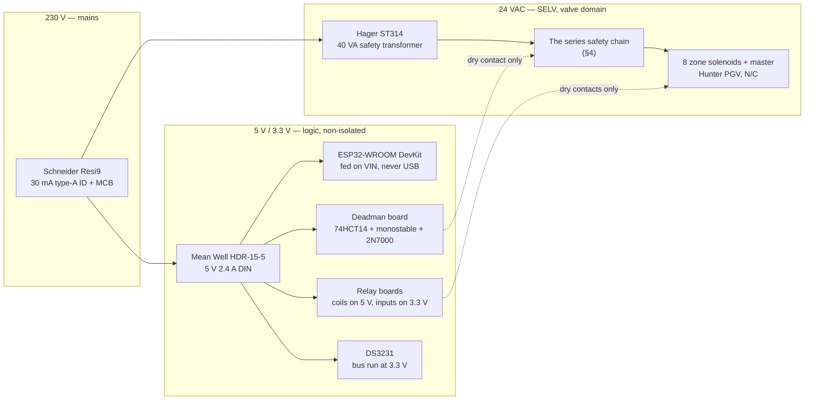
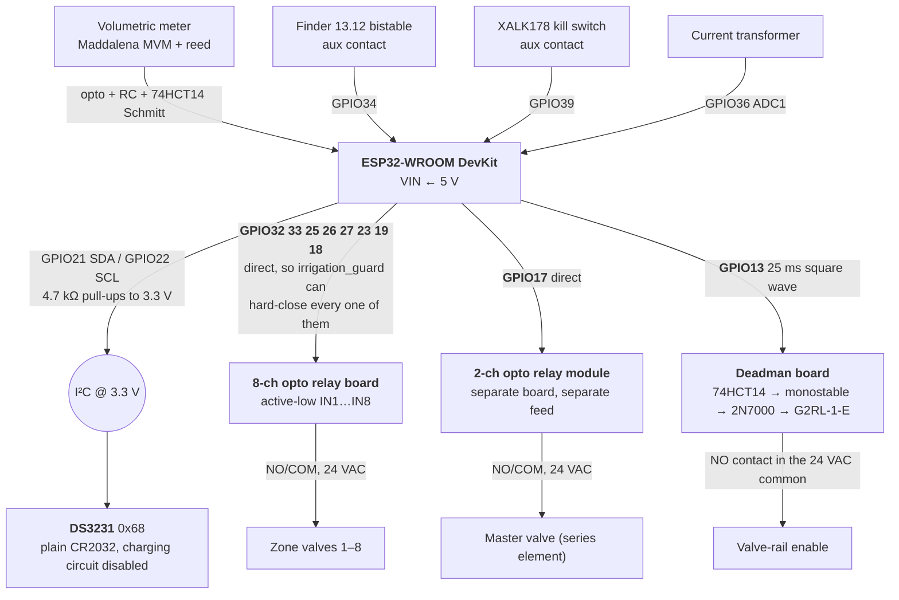

[← Documentation index](../README.md)

# 22. Wiring — the global interconnect diagram

Everything in this file is derived from [§7 hardware](05-hardware.md), [§19 the BOM](19-bill-of-materials.md)
and the config that is actually flashed (`sprinkler.yaml`, `packages/`). Nothing new is decided here
except where a line is explicitly marked **open**.

**Two builds are described, and they are not the same wiring:**

| | **v1 — the garden build** | **v0 — the bench build (what is flashed today)** |
|---|---|---|
| Zones | 8 | **8, direct GPIO** — 32, 33, 25, 26, 27, 23, 19, 18 |
| Master | GPIO17, separate 2-channel module | GPIO17, same |
| Water | Yes | **None. LEDs where the solenoids go.** |
| 24 VAC domain | Everything below | **Not built** |

Both builds use **direct GPIO for all eight zones**. **The guard can only hard-close pins it can write
directly**, so every pin that can reach a coil is one it owns — and the moment you most want that raw
sweep is the moment nothing cooperative is running. None of the eight wired pins is a strapping pin,
so the GPIO12 hazard does not arise in the firmware. See the header of
[packages/zones.yaml](../packages/zones.yaml) and the as-wired note in [§7](05-hardware.md#pin-map).

**Eight zones are wired; four are planted.** That is a schedule distinction, not a wiring one: a zone
with 0 minutes in every program is left out of the resolved plan entirely, so the fifth bed costs a
duration edit rather than a rewire.

---

## 1. The three electrical domains

Keep these separate in your head and separate in the box. Every mistake in this design that could
hurt someone lives at a boundary between two of them.



**The two rules that hold the domains apart:**

- **Valve inrush must not brown out the MCU.** Separate transformer for the valves, separate SMPS for
  the logic. One zone + master ≈ 17.8 VA worst case, which is why the transformer is 40 VA and not 18.
- **Logic ground never touches the relay board's `GND`.** On an opto board the input side needs only
  `VCC` and the `IN` pins. **Remove the JD-VCC jumper** — with it fitted the board is *not* isolated
  despite the optocouplers.

**Never power the DevKit from USB.** A second power path into the `5V`/USB pins is mutually exclusive
with `VIN`, and NFR-P3 (clean brownout with valves closed) is untestable on a wall-wart. Confirm your
DevKit exposes **VIN**, not only 3V3.

---

## 2. The global interconnect



`GPIO13` goes to the deadman **and to nothing else**. The guard's codegen enforces it: the heartbeat,
master and zone pins must all be distinct, *"a shared pin means the deadman and a valve drive each
other"* — [components/irrigation_guard/__init__.py:99-105](../components/irrigation_guard/__init__.py#L99-L105).

---

## 3. Pin map

### v1 — garden build

| Pin | Function | Dir | Wiring detail |
|---|---|---|---|
| **GPIO21** | I²C SDA | I/O | DS3231, **4.7 kΩ pull-up to 3.3 V**. Run the whole bus at 3.3 V. |
| **GPIO22** | I²C SCL | I/O | idem |
| **GPIO32, 33, 25, 26, 27, 23, 19, 18** | Zones 1–8, direct | out | → relay board `IN1…IN8`. `inverted: true` (active-low board). Each is `allow_other_uses: true`, shared between the GPIO switch and `irrigation_guard` on purpose — the guard writes them raw, with no cached switch state in the path. |
| **GPIO17** | **Master valve** | out | → the *separate* 2-ch module. Direct GPIO on purpose: an I²C lock-up (a slave holding SDA low — a real event in a noisy 24 VAC box) must still leave the firmware able to close the series element. |
| **GPIO13** | **Deadman heartbeat** | out | → 74HCT14 input. Not shared, not `allow_other_uses`. |
| **GPIO35** | Flow-meter pulse | **in only** | External **10 kΩ pull-up** — GPIO34–39 have no internal pulls. Reed → opto → RC → Schmitt (§6). |
| **GPIO34** | Latch "tripped" sense | **in only** | External pull-up. From the bistable's aux contact → raises a CRITICAL in HA (R23). |
| **GPIO39** | Kill-switch sense | **in only** | ADC1, unaffected by Wi-Fi. |
| **GPIO36** | Current sense (CT) | **in only** | ADC1. Distinguishes "commanded on / no current / no water" from "commanded on / current / no water" — completely different repairs. |
| Spare | **4, 14, 16** | | Three pins, not eleven — the other eight are zones now. Enough for the rain gauge (D11), a status LED and one physical button; a button *per zone* (FR-11) does not fit the pin budget and needs its own input path — **open**. |

### v0 — bench build, as flashed

| Pin | Function | Source |
|---|---|---|
| **GPIO32, 33, 25, 26, 27, 23, 19, 18** | Zones 1–8, direct | [sprinkler.yaml](../sprinkler.yaml) substitutions |
| **GPIO17** | Master | idem |
| **GPIO13** | Deadman heartbeat | idem |

Identical to the v1 pin map above, which is the point: the bench proves the wiring that ships. What
is missing is everything downstream — no 24 VAC, no valves, LEDs where the solenoids go — and no I²C,
because the DS3231 package is written but not included until the module is fitted.

**All nine output pins reach the guard.** `PANIC_PINS[] = {17, 32, 33, 25, 26, 27, 23, 19, 18}` is
generated from the guard's own config, so the `on_safe_mode` sweep closes exactly the pins the guard
drives and cannot drift out of step with them.

### Forbidden pins — enforced in code, not by memory

**`0, 1, 2, 3, 5, 6–11, 12, 15`.** The guard's config schema rejects every one of them for a valve or
heartbeat pin rather than trusting anyone to remember.

> ⚠️ **GPIO12 (MTDI) is the one that must be respected absolutely.** Every relay `IN` line carries a
> 1 kΩ pull-up. On MTDI that holds the strapping pin high at reset, selects a **1.8 V VDD_SDIO**,
> browns out the 3.3 V flash, and **the board will not boot or flash [V]**. Nine relay inputs is nine
> chances to make this mistake — including a future you rewiring the box with cold hands.

---

## 4. The 24 VAC series chain — and why the order of the elements is the design

Each valve is switched on its **hot** leg by a relay contact. The **return** legs are where the three
hardware safety layers sit, in series, and *which common each one sits in* is load-bearing.

```
  Hager ST314, 40 VA, SELV
  ┌──────────────────────────────────────────────────────────────────────────┐
  │                                                                          │
  │  24 VAC hot bus                                                          │
  ├──────► CH1 COM ─[NO]─► zone 1 solenoid ──┐                               │
  ├──────► …                                 │                               │
  ├──────► CH8 COM ─[NO]─► zone 8 solenoid ──┤                               │
  │                                          │                               │
  │                              ZONE-SIDE COMMON  ◄── the 8 returns, only   │
  │                                          │                               │
  │                          ┌───────────────┴───────────────┐               │
  │                          │  Finder 13.12 Set/Reset       │  ◄ THE LATCH  │
  │                          │  bistable, NO contact         │               │
  │                          └───────────────┬───────────────┘               │
  │                                          │                               │
  ├──────► master module COM ─[NO]─► master solenoid ─┐                      │
  │                                                   │                      │
  │                          OVERALL 24 VAC COMMON ◄──┴──────────────────────┤
  │                                          │                               │
  │                    [G2RL-1-E deadman enable contact]                     │
  │                                          │                               │
  │                    [XALK178 NC kill switch]                              │
  │                                          │                               │
  └──────────────────────────────────────────┘  transformer common           │
```

**Three placements, three different reasons:**

| Element | Where | Why *there* |
|---|---|---|
| **Latching max-runtime timer** | **Zone-side common only** | A full cycle is the *sum* of all zone runs and can reach **4 h 30+**, with the master energised throughout. A 60-min timer in the overall common **trips mid-cycle and shuts the garden down** — a safety device manufacturing the outage it exists to prevent, appearing in August with everyone away. On the zone-side common it bounds **a single zone run**, which is what the requirement always meant, and the **5–10 s inter-zone settle gap resets it for free**. |
| **Deadman enable** | Overall 24 VAC common | It must kill *everything*, master included, when the application stops proving it is alive. |
| **NC kill switch** | Overall 24 VAC common | **Downstream of every possible electronic fault** — welded relay, shorted rail, firmware that has lost its mind. NFR-S5: at least one shutdown path with no software in it. |

The deadman contact and the kill switch are in series in the same common, so their relative order is
electrically irrelevant. Put the kill switch nearest the transformer anyway: the next person to open
this box should be able to trace "the red button breaks this wire" without reading a document.

**Consequent requirement, and it is now a safety requirement rather than a hydraulic nicety:**
`valve_open_delay` (the inter-zone settle gap) must be **comfortably longer than the timer's reset
time**. The 5–10 s already specified for diaphragm seating covers it — **verify it on the bench (E6)**.

### The latch, wired

- **Finder 80.01** multifunction timer, supplied from the **zone-side common**, so it starts timing
  when any zone energises and resets when the settle gap de-energises it. Period **~1.5× the longest
  legitimate single-zone run** — 35-min rotors ⇒ set **60 min, not 45**.
- At timeout its contact pulses the bistable's **RESET** input → the zone-side common opens and
  **stays open**.
- **SET** comes from the **XALK178 reset station** — a human, deliberately. *(This is a second
  XALK178, separate from the kill switch of §C3. The BOM prices both.)*
- The bistable's **aux contact → GPIO34**, so the latch raises its own CRITICAL. One wire, and it is
  the difference between "the garden stopped in August and nobody knows why" and an actionable alarm.

> ⚠️ **Set/Reset bistable, never a télérupteur.** A télérupteur **toggles on every pulse**, so contact
> bounce or a second trigger from a crash-looping controller flips it **back on**. Per Finder's S13FR
> datasheet, on a bistable *"only a pulse on the RESET command will open the relay's contacts."*
> Also: every priceable télérupteur has a **230 V coil**, which would drag an interposing relay into
> the safety chain; the **13.12.0.024.0000 is 12–24 V AC/DC** and keeps the whole latch inside the
> 24 VAC domain. Two independent reasons.

> ⚠️ **Finder 80 in `DI` (interval) mode is not a latch, and it looks like one.** Its reset is
> *"remove the timer's supply"*, not *"press a button"* — so a crash-looping ESP32 that re-pulses its
> output power-cycles the timer and buys itself another full *T* minutes, **indefinitely**. That is
> precisely the failure being defended against.

---

## 5. The deadman board — corrected schematic

This is the €38 that delivers P0. **Build it twice** (one fitted, one spare) — the spare is what lets
you *destructively* test the first, which is what E6 requires.

```
  GPIO13 ──► 25 ms square wave, emitted ONLY while the main loop
    │        keeps incrementing a counter the esp_timer callback reads
    ▼
  ┌──────────────────────┐
  │  74HCT14, on 5 V     │   The "T" is what accepts 3.3 V logic on a 5 V rail.
  │  hex Schmitt inverter│   Not optional — see the note below.
  └──────────┬───────────┘
             │ 5 V edges
             ▼
  ┌──────────────────────────────────────┐
  │  74HC123 / CD4538                    │   Retriggerable monostable, Rt·Ct ⇒ T ≈ 1 s.
  │  retriggerable monostable, T ≈ 1 s   │   Q holds ONLY while edges keep arriving,
  └──────────┬───────────────────────────┘   and drops cleanly ~1 s after the last one.
             │ Q
             ▼
  ┌──────────────────────┐
  │  2N7000 (TO-92)      │   The G2RL coil is 80 mA / 400 mW — ~20× what a
  │  logic-level N-FET   │   74HCT14 output can source. The FET stage is MANDATORY.
  └──────────┬───────────┘   (A 47 A IRLZ44N to switch 80 mA is 30× the price for nothing.)
             │ drain
             ▼
  ┌──────────────────────┐
  │  G2RL-1-E DC5 coil   │──┤◄├── flyback diode across the coil
  │  5 V, 80 mA          │
  └──────────┬───────────┘
             │ NO contact
             ▼
     in series in the OVERALL 24 VAC COMMON  ⇒  the valve-rail enable

  Also on the board: a test point on the enable node, and a front-panel LED on
  the enable rail, so "enable asserted" is visible without a meter.
```

**Why it is qualitatively better than a level-based enable:** it is sensitive to **activity, not
state**. A level-based enable cannot distinguish *"firmware fine, pin high"* from *"firmware dead, pin
high"*. Only a *changing* signal survives the monostable. That is the one dangerous case nothing else
in this design catches (risk **R1**: an ESP32 CPU reset leaves GPIO output-enable **and level** intact,
so a crash loop can hold a valve open indefinitely while the device looks healthy online).

**Firmware side, for completeness** — the half that makes the circuit mean anything:
`GPIO13` is toggled from an independent `esp_timer` callback that checks a counter only `loop()`
increments; stale counter ⇒ it stops toggling **and** closes the GPIOs itself
([irrigation_guard.cpp:101-149](../components/irrigation_guard/irrigation_guard.cpp#L101-L149)).
**Never LEDC** (it free-runs in hardware and would hold the rail enabled through a total firmware
hang) and **never `loop()`** (16 ms interval caps the rate at ~31 Hz). If you can stop the code and
the wave continues, the design is wrong.

**Status: design corrected, not yet validated.** Verification **E6** — prove the rail de-energises
under a *deliberately hung* firmware, not by pulling power, which any design passes — **gates
connecting any valve**.

---

## 6. Relay boards — the wiring rules that are not obvious

The relay contacts are comfortably adequate (SRD-05VDC-SL-C: 3 A/120 VAC inductive against 24 VAC at
~0.5 A, ~137 years at this duty). **Three properties of the board must be measured before it is
trusted with water**, and one of them can disqualify it outright.

| | Wiring |
|---|---|
| **JD-VCC jumper** | **Remove it.** With it fitted the board is *not* isolated despite the optocouplers. |
| **JD-VCC + board GND** | From the **5 V** rail — this is the coil supply. |
| **Input-header VCC** | From **3.3 V**, not 5 V (test T4). With `VCC = 5 V` and a 3.3 V push-pull driver the "off" state leaves **1.7 V across the opto LED** — near threshold, so the relay can sit half-on, chatter, or latch. |
| **Input-side GND** | **Do not connect logic ground to the board's GND.** The input side needs only `VCC` and the `IN` pins. |
| **Contacts** | Each channel must be a **3-way** terminal (NO/COM/NC). Use NO. |

**The three go/no-go bench tests (E1–E3), before anything is plumbed:**

- **T1 — dry, independent contacts.** DMM continuity: **COM↔COM must be open.** Bussed COMs ⇒ the
  board cannot switch 24 VAC and is unusable.
- **T3 — polarity and floating-input behaviour. The single most important test.** Power the board with
  **nothing connected to the `IN` pins** and listen. Relays must stay silent. "High/low trigger
  selectable" boards exist; set to high-trigger, everything inverts and the board's own input pull-ups
  **energise every relay the instant power comes up**, before a line of firmware runs.
- **T4 — 3.3 V drive adequacy, and test it *cold*.** ~2.05 mA through the LED against a 3.7 mA design
  point. Optocoupler CTR falls at low current *and* low temperature — a relay that works on a warm
  September bench can fail to pull in on a February morning. If marginal, change R1 from 1 kΩ to
  **470 Ω** (≈4.4 mA) — **not** the 220 Ω some vendor notes suggest: 470 Ω already restores the design
  margin, so the extra drive buys nothing and only heats the LED.

**Do not drive the relays through a ULN2003** — that inverts the polarity into all-relays-on.

**Why the master gets its own €3 module:** it is the series element of the hydraulic AND gate. A
physically separate board with its own power feed and its own driver pin means no single board-level
common-cause failure — a shorted rail, a flooded connector, a crack across the PCB — can weld a zone
relay *and* the master closed simultaneously. Buy two, so one is a hot spare.

**What makes active-low safe:** ESP32 Datasheet v5.3, Appendix A.1 note 9 — *"During reset, all pins
are output-disabled."* Every pin is high-impedance at reset, and the board's own 1 kΩ pulls `IN` up,
so **"booting, absent, in reset, or with the wire fallen off" resolves to relay OFF by construction**,
with no external components. `relay_active_low: "true"` in `sprinkler.yaml` encodes this — **and T3 is
what earns the right to trust it.**

---

## 7. Sense inputs

### Flow meter — three defences, use all three

A reed switch bounces for **1–5 ms**, two to three orders of magnitude longer than **PCNT's 13 µs
filter ceiling [V]**. A raw reed on PCNT counts **3–10 "litres" per litre.**

```
  Maddalena MVM DN15 + Reed MVM (0.5 L/pulse)
        │  metres of cable away
        ▼
  [opto-isolator]          the reed is remote — you want isolation anyway
        ▼
  [RC: 10 kΩ + 100 nF, τ = 1 ms]
        ▼
  [74HCT14 Schmitt gate]   the SAME package as the deadman: one €0.60 chip, two jobs
        ▼
  GPIO35  +  external 10 kΩ pull-up      →  ESPHome `pulse_meter` (ISR), NOT `pulse_counter`
```

Plus a **software plausibility gate rejecting anything under ~200 ms**. At 0.5–1 L/pulse a
plumbing-limited 60 L/min still means a minimum legitimate interval of ~0.5–1 s, so the margin is
enormous. Provide the pull-up yourself and keep contact current **≤1 mA** to avoid erosion.

### The two dry contacts and the CT

| Signal | Pin | Wiring |
|---|---|---|
| Latch tripped | GPIO34 | Bistable aux contact to GND, external pull-up to 3.3 V. Inverted in firmware. |
| Kill switch position | GPIO39 | Aux contact. Makes a physically-stopped system *visible* remotely. |
| Zone current | GPIO36 | CT on the 24 VAC hot bus, into ADC1 (ADC2 is unusable with Wi-Fi). |

`GPIO34/35/36/39` are **input-only and have no internal pull-ups or pull-downs.** Every one of them
needs its resistor fitted on the board.

---

## 8. Assembly order, and what gates what

1. **T1 + T3** on the relay board — 20 min with a DMM and your ears. **Either can disqualify the board
   and change the whole 24 VAC topology, so do this before ordering anything.**
2. Build the deadman board (twice). Bench it on a logic analyser: heartbeat present ⇒ enable asserted;
   heartbeat stopped ⇒ enable drops in ~1 s.
3. **E6 — hang the firmware on purpose** (`BENCH starve the deadman (3 s)` in
   [packages/ui.yaml:457-476](../packages/ui.yaml#L457-L476) exercises the counter-staleness half from
   a desk; the real proof is a genuinely hung task) and confirm the **rail** de-energises. Not by
   pulling power — any design passes that.
4. Wire the latch, and confirm the **timer resets inside the inter-zone settle gap**.
5. **Only then** connect a valve.

---

## 9. Open points

These are gaps in the sources, not decisions taken here.

- **The BOM's §C1 has not caught up with the hardware correction.** It still lists the parts for the
  **AC-coupled charge pump** (`BAT85` × 2, 100 nF / 4.7 µF / 220 kΩ) and still advises *"generate the
  square wave from a hardware timer but re-arm it from the supervisory loop"* — which is exactly the
  LEDC design [§7](05-hardware.md) rejects as non-functional. **No monostable (74HC123 / CD4538) appears
  anywhere in the BOM.** Add one to the order; the diodes and the pump passives are no longer needed.
- **The bistable's SET path is not fully specified.** §19 says *"the ESP32 path can only ever SET"*
  while the recommended build shows the XALK178 station doing it. If an ESP32-driven SET is wanted
  (auto-rearm after an operator acknowledges in HA), it needs a spare GPIO and an interposing contact
  into the 24 V domain — **and it deserves an explicit argument**, because an automatic SET quietly
  removes the "a human must look at it" property the latch exists for.
- **The status LED, physical zone buttons and master switch (FR-11) have no pins assigned.** Eleven
  spares exist; nothing has claimed them.
